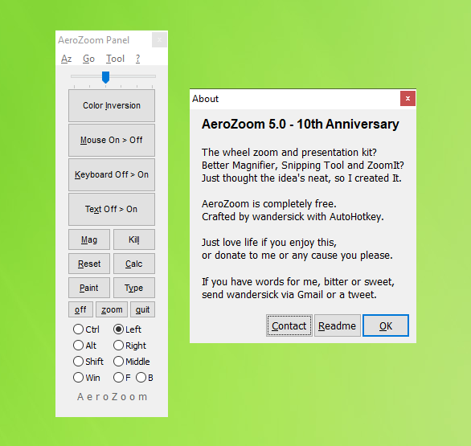

## AeroZoom 5.0 Features (TBC)

The next version of AeroZoom (5.0) will be available after the testing phase, which involves my testing as well as yours – help improve quality by becoming a beta tester. Email wandersick@gmail.com if interested. (Thanks!)

AeroZoom 5.0 Features (TBC)

- Hide Magnifier Glass
  - The ability to completely hide Magnifier glass (i.e. Windows Magnifier) is back for Windows 10 starting from 1607 and up (Note: This feature was available for Windows 7 only)

- Smart Click Disabler
  - Optimized single-handed mouse zooming, thanks to an improved mechanism to prevent misfire of left/right/forward/back clicks while zooming, available as a tool under AeroZoom Panel menu as Smart Click Disabler, which is better than the existing Misclick-Preventing Pad
  - Enables use of AeroZoom during full-screen PowerPoint presentation, etc.

- User-Contributed Settings
  - Users can now share their mouse-optimized AeroZoom settings to benefit others. For example, SwiftPoint GT mouse-optimized settings are included in AeroZoom 5.0
    - User-Contributed Settings (Az > Quick Profile Switch) now accepts contributions from AeroZoom users who can share their AeroZoom profiles with other users
      - Simply export your config (Az > Config File > Export Settings) and email <a href="mailto:wandersick@gmail.com">wandersick@gmail.com</a> with a description. Your contribution will be considered for inclusion in the next version
    - In AeroZoom 5.0, User-Contributed Settings are included for the SwiftPoint GT mouse, which reserves Left+Right for its own trigger of middle button, as it does not have a standalone middle button.
      - With the feature, SwiftPoint GT users can now trigger AeroZoom Panel by pressing Left+Right. Enable User-Contributed Settings at "Az > Quick Profile Switch > User-Contributed Settings > 2. SwiftPoint GT" which enables the below settings:
        - Pick an action: Show/hide panel
        - How long to hold the middle button (in ms): 0
        - [Check] Disable Full Screen Preview auto switching
        - [Check] Disable ZoomIt auto switching
        - [Check] Disable Zoom Reset hotkey

      - Users with a normal mouse (i.e. with a middle button) may consider configuring Holding Middle function to trigger "ZoomIt: Draw" (a useful pen for drawing on screen) or other features instead

- Run Prompt
  - The command `AeroZoom` is now available in Run prompt if AeroZoom has been installed to the system

- Center Zoom
  - The Center Zoom feature allows zooming to start from the center of the screen, is now out of 'beta' and moved to a more accessible menu location (Tool > Center Zoom)

- Support for Windows 10 1903
  - Rename tools in 'Windows Tools' to reflect recent Windows changes

- Updates to AeroZoom Dependencies
  - Base AutoHotKey updated to v1.1.30.01 (November 11, 2018)
  - Update `wget.exe` to fix `zoomit.exe` download issue while retaining Windows XP support

- More Deployment Options
  - New unattended installer is available for download. While existing `Setup.exe` also support silent installation, it is a separate file next to AeroZoom program files, unlike the new installer which contains the AeroZoom program files. See https://github.com/wandersick/az-autohotkey-silent-setup
  - Availability on Chocolatey community repository, https://chocolatey.org/packages/aerozoom, installable by command `choco install aerozoom`

- UX Improvement
  - Holding middle button now defaults to New Snip (of Snipping Tool) or Win+Shift+S if on a supported Windows 10 release
  - Right-clicking AeroZoom panel edges no longer triggers a sudden confusing switch between mini and full user interface

- Deprecation of AeroSnip
  - AeroSnip feature is now deprecated (remains supporting Vista and 7) due to certain issues it has with Snipping Tool of recent Windows releases, as well as its uncertain future having been deprecated by Microsoft in late 2018

- Bug Fixes

  - AeroZoom `Setup.exe`, while uninstalls successfully, fails to delete AeroZoom_*x64.exe files due to being in use
  - AeroZoom `Setup.exe` does not uninstall itself cleanly, leaving `Setup.exe` in the installation directory
  - Download failure of `zoomit.exe`
  - Update checker inaccurately reports an update exists
  - Holding middle button triggers new snip despite being configured not to in the last release
